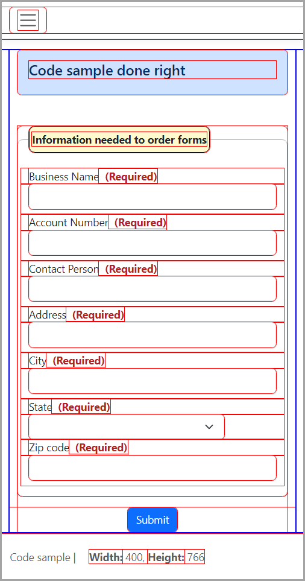

# About

When developing a page, if it done incorrectly one of the best methods to see what the issue(s) are is to surround each element with a border.

There are two pages, the first done incorrectly for a responsive design, shrink the page down width wise and note the elements do not resize properly. Press CTRL+ALT+1 to see the issues. Do the same for the other page and all elements resize correctly.



## Uses a database....
EF Core is used to obtain data for a list of states, the script is in the script folder to populate the database.

---

Code for creating borders is in site.js

```javascript
document.addEventListener('keydown', function (event) {

    if (event.key === '1' && event.altKey && event.ctrlKey) {
        $debugHelper.toggle();
    }

});
```

## Bonus

Code for the footer to show the client window size.


## Code for surrounding elements

Then `lib/payne-debugger/debugHelper.min.js` contains code to include/exclude `lib/debugger.css`

```javascript
var $debugHelper = $debugHelper || {};
$debugHelper = function () {
    var href = "debugger.css";
    var addCss = function () {
        if (styleStyleIsLoaded(href) === true) {
            return;
        }
        const head = document.head;
        const link = document.createElement("link");
        link.type = "text/css";
        link.rel = "stylesheet";
        link.href = href;
        head.appendChild(link);
        head.appendChild(link);
    };
    var removeCss = function () {
        if (styleStyleIsLoaded('debugger.css')) {
            document.querySelector(`link[href$="${href}"]`).remove();
        }
    };
    var toggle = function() {
        if (styleStyleIsLoaded(href) === true) {
            removeCss();
        } else {
            addCss();
        }
    }
    var styleStyleIsLoaded = function () {
        for (var index = 0, count = document.styleSheets.length; index < count; index++) {
            const sheet = document.styleSheets[index];
            if (!sheet.href) {
                continue;
            }
            if (sheet.href.includes(href)) {
                return true;
            }
        }
        return false;
    }
    return {
        addCss: addCss,
        removeCss: removeCss,
        isCSSLinkLoaded: styleStyleIsLoaded,
        toggle: toggle
    };
}();
```

Stylesheet

```css
* {
    outline: 1px solid red;
}

    *:hover {
        outline: 2px solid blue;
    }

    ```

